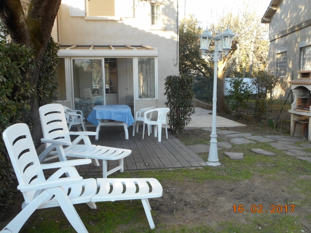

<html>

<head>
	<meta http-equiv="content-type" content="text/html; charset=UTF-8">
	<title>Oubangi Chari - Royan</title>
	<meta charset="utf-8">
	<meta name="viewport" content="width=device-width, initial-scale=1">
	<meta name="author" content="Oubangichari">
	<meta name="description" content="Page de présentation d'Oubangichari, maison de vacances à Royan">
	<link rel="icon" href="img/sun.png">
	<meta name="keywords" content="Oubangichari, location, Royan">
	<link rel="stylesheet" href="css/bootstrap-3.3.7.min.css">
	<link rel="stylesheet" href="css/oubangichari.css">
	
	
	<!--  -->

</head>

<body>

<header >
	
	<h1>Oubangi Chari</h1>
	
Maison de vacances à Royan

	<a href="#contact"  >
		<button id="contactHome"> 
			&nbsp; Contact &nbsp;
			
		</button>
	</a>

	
  Au calme, mais proche de la plage et des commerces (marché du parc), Oubangi Chari est une petite maison de deux chambres, agrémentée d'une veranda, d'un jardin et d'une terrasse ombragée.

</header>

	

		

			<h2 id="description">Description</h2>
			
Maison indépendante dans le quartier résidentiel du parc de Royan.

			
Commerces et marché à 200 M, grande plage à 500 M.

			
Maison de 70 M2 pour 4 à 5 personnes comprenant :

			
Rdc : 
 
						<ul> 
							<li> cuisine ouverte (plaque gaz, four , micro-ondes, lave linge,  lave vaisselle, réfrigérateur avec congélateur)</li> 
							<li> Salon / salle à manger (télévision, canapé fixe ) </li> 
							<li> Entrée, wc indépendant, véranda couverte </li> 
						</ul>   
			
			
Étage :

						<ul> 
							<li> 1 chambre ( lit 140, penderie )</li> 
							<li> 1 chambre (lit 140 + lit 80 , commode )</li> 
							<li> Salle d'eau ( lavabo, douche, wc )</li> 
						</ul>
			
			
Jardin clos d'environ 200 M2 avec ombre et soleil, barbecue, terrasse,
			 salon de jardin, transats, accès pour voiture. 

			
Ensemble calme et reposant.
           

			      
			<h2 id="photos">Photos</h2>
			

				<!-- Indicators -->
				<ol class="carousel-indicators">
					<li data-target="#myCarousel" data-slide-to="0" class="active"></li>
					<li data-target="#myCarousel" data-slide-to="1"></li>
					<li data-target="#myCarousel" data-slide-to="2"></li>
					<li data-target="#myCarousel" data-slide-to="3"></li>
					<li data-target="#myCarousel" data-slide-to="4"></li>
					<li data-target="#myCarousel" data-slide-to="5"></li>
					<li data-target="#myCarousel" data-slide-to="6"></li>					
				</ol>

			 	<!-- Wrapper for slides -->
			 	

					

						
						

							<h3>Extérieur 1</h3>
							
Jardin clos d'environ 200 M2 avec ombre et soleil, barbecue, terrasse, salon de jardin, transats, et accès pour voiture. 

						

					

					

						
						

							<h3>Extérieur 2</h3>
						

					

					

						
						

							<h3>RDC : Salon / salle à manger</h3>
							
 Avec télévision et canapé fixe

						

					

					

						
						

							<h3>RDC : Cuisine ouverte</h3>
							
Plaque gaz, four , micro-ondes, lave-linge, lave-vaisselle, réfrigérateur avec congélateur

						

					

					

						
						

							<h3>Étage : chambre avec deux lits</h3>
						

					

					

						
						

							<h3>Étage : deuxième chambre</h3>
						

					

					

						
						

							<h3>Étage : salle de bains</h3>
						

					

				

				  <!-- Left and right controls -->
				<a class="left carousel-control" href="#myCarousel" role="button" data-slide="prev">
					
						 
					
					Previous
				</a>
				<a class="right carousel-control" href="#myCarousel" role="button" data-slide="next">
					
						
					

					Next
				</a>
			

		

		

			<h2  id="localisation">Localisation</h2>
			<iframe src="https://www.google.com/maps/embed?pb=!1m18!1m12!1m3!1d2790.646981174878!2d-1.0097244106184464!3d45.61773773518419!2m3!1f0!2f0!3f0!3m2!1i1024!2i768!4f13.1!3m3!1m2!1s0x48017673794cf55f%3A0x50df63eaef416d6b!2sAll%C3%A9e+des+Marronniers%2C+17200+Royan!5e0!3m2!1sfr!2sfr!4v1488452295728" width="100%" height="360" frameborder="0" style="border:0" allowfullscreen></iframe>

			<h2 id="agenda">Disponibilités</h2>
			<iframe src="https://calendar.google.com/calendar/embed?src=oubangichari%40gmail.com&showTz=0&showTitle=0&amp;showPrint=0&amp;showTabs=0&amp;showCalendars=0&amp;height=300&amp;wkst=7&amp;bgcolor=%23FFFFFF&amp;ctz=Europe%2FParis" style="border-width:0" width="100%" height="360" frameborder="0" scrolling="no"></iframe>
		

	

	

		<h2 id="contact">Contact et réservation</h2>
		<ul >
			<li>
				<a href="mailto:oubangichari@gmail.com" class="contactFrame" id="showEmailAdress"> 
					
					 
					<i>  Cliquer pour envoyer un mail à </i>
					 
					oubangichari@gmail.com
				</a>
				
			</li>
			<li >
				

					
					 
					Numéro de téléphone :
					 
					06 71 50 56 51
				

			</li>
		</ul>
	

</body>

</html>

