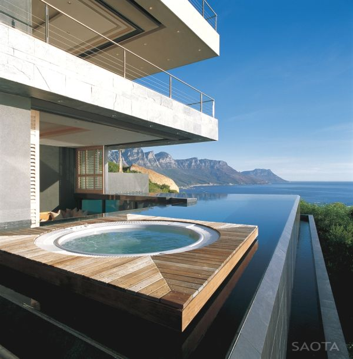

<html>

<head>
	<meta http-equiv="content-type" content="text/html; charset=UTF-8">
	<title>Oubangi Chari - maison à Royan</title>
	<meta charset="utf-8">
	<meta name="viewport" content="width=device-width, initial-scale=1">
	<meta name="author" content="Oubangichari">
	<meta name="description" content="Page de présentation d'Oubangichari, maison de vacances à Royan">
	<meta name="keywords" content="Oubangichari, location, Royan">
	<link rel="stylesheet" href="oubangichari.css">
</head>

<body>

<header >
	
	<h1>Oubangi Chari</h1>
	
Maison de vacances à Royan

	
Au calme et proche de la plage

</header>

<nav>
	<ul >
		<li><a href="#description">Description</a></li>
		<li><a href="#photos">Photos</a></li>
		<li><a href="#agenda">Disponibilités</a></li>
		<li><a href="#contact">Réserver</a></li>
	</ul>
</nav>

		
	<h2 id="description">Description</h2>
	Au calme, mais proche de la plage et des commerces (marché du parc), Oubangi Chari est une petite maison de deux chambres, agrémentée d'une veranda, d'un jardin et d'une terrasse ombragée.

	<h2 id="photos">Photos</h2>
	

	<h2 id="agenda">Disponibilités</h2>
	<iframe src="https://calendar.google.com/calendar/embed?src=oubangichari%40gmail.com&showTz=0&showTitle=0&amp;showPrint=0&amp;showTabs=0&amp;showCalendars=0&amp;height=300&amp;wkst=7&amp;bgcolor=%23FFFFFF&amp;ctz=Europe%2FParis" style="border-width:0" width="400" height="300" frameborder="0" scrolling="no"></iframe>

	<h2  id="contact">Réserver</h2>
	<a href="mailto:oubangichari@gmail.com" class="icon fa-envelope alt">
		Email
	</a>

</body>

</html>

